# GlowNote Android

> 把网页里真正值得留下的内容，变成可回看的阅读轨迹。

当前版本：`0.0.5`

GlowNote Android 是 GlowNote 的移动客户端：在应用内打开网页，看到重要内容时直接高亮、写批注、加标签，之后从文章库回到原文和上下文。它与桌面 GlowNote / Chrome 扩展共享同一套 WebDAV 数据，让手机上的阅读记录可以继续在其他设备上使用。


## 客户端功能

### 内置浏览器：从“看到”到“记录”不切换

- 在应用内打开任意 `http(s)` 网页，也可以直接输入关键词搜索。
- 支持 Google、DuckDuckGo、Bing 和百度搜索，可在设置中切换默认搜索引擎。
- 支持多标签页、新建标签、浏览历史、搜索历史和网页收藏。
- 从其他应用复制网页链接后，GlowNote 可以检测剪贴板并提示打开。
- 网页地址可以直接分享给其他应用；打开公众号文章、普通文章页和文档页后，都可以继续使用高亮流程。

### 高亮、批注与标签：把重点和想法一起留下

- 长按选择文字，选择黄色、红色、蓝色、绿色或橙色高亮。
- 为高亮写批注；批注中的 `#标签` 会自动进入文章标签。
- 点击已有高亮可以重新编辑颜色、批注和标签，也可以删除或复制高亮文本。
- 从文章库搜索高亮文本、批注和标签，并回到原网页中的对应位置。
- 对微信公众号文章等带有动态内容的页面，也保留了网页选区和高亮交互。

### 阅读模式：把网页变成适合自己的长文

- 一键进入阅读模式，去掉页面干扰，只保留主要内容。
- 可调整背景、字体大小、行间距和页间距。
- 阅读设置会保存到本地，下次打开时继续使用。

### 文章库：让记录真正可回看

- 按来源 URL 聚合文章，同一篇文章的多条高亮和批注集中管理。
- 查看文章的高亮数量、批注内容和标签；支持收藏文章、修改标题和删除文章。
- 文章库提供“高亮与批注热力图”，帮助回顾一段时间内的阅读密度。
- 点击某条记录即可重新打开原网页，并定位到对应高亮。

### WebDAV 同步：手机、桌面和扩展保持一致

- 与桌面 GlowNote / Chrome 扩展共用 WebDAV 快照：`/highlight-extension/sync.json`。
- 在设置中填写服务器地址、同步路径和账号信息，可先测试连接，再手动同步。
- 同步文章、高亮、批注、标签、收藏状态及定位锚点；未知字段会保留，避免覆盖桌面端元数据。
- WebDAV 密码使用 Android Keystore 加密保存在本地；服务器端仍是明文 JSON，建议使用 HTTPS。

## 运行截图

以下截图来自APP真实截图。点击图片可查看原图。

<table>
  <tr>
    <td align="center">
      <a href="rawpics/Screenshot_20260818_221401.jpg">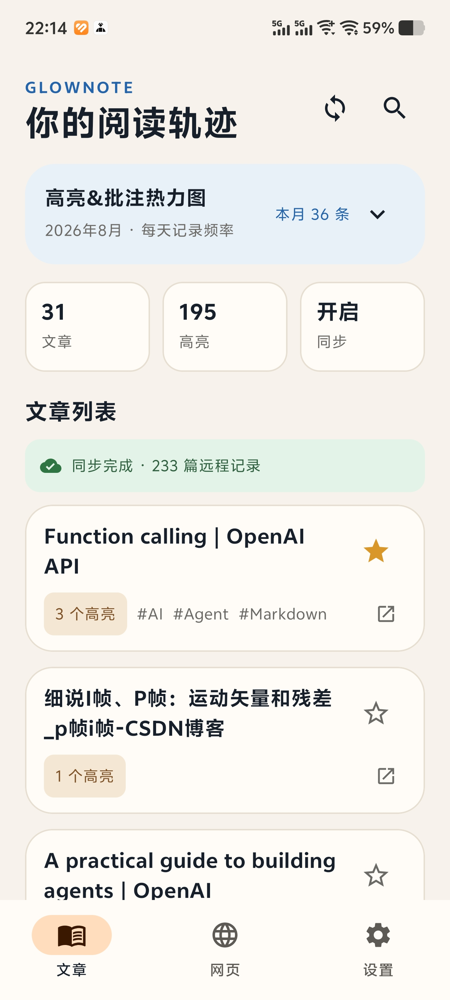</a><br />文章库与阅读轨迹
    </td>
    <td align="center">
      <a href="rawpics/Screenshot_20260818_221408.jpg">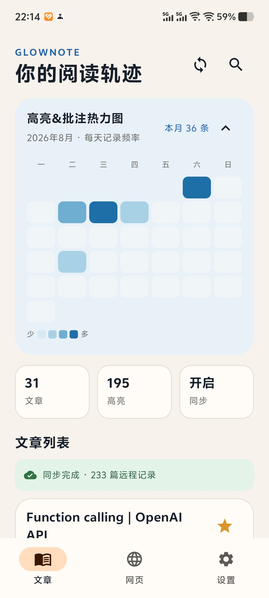</a><br />高亮批注热力图
    </td>
    <td align="center">
      <a href="rawpics/Screenshot_20260818_221551.jpg">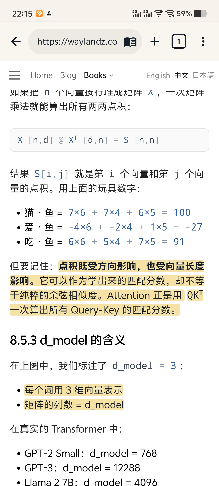</a><br />网页选区与高亮工具栏
    </td>
  </tr>
  <tr>
    <td align="center">
      <a href="rawpics/Screenshot_20260818_221543.jpg">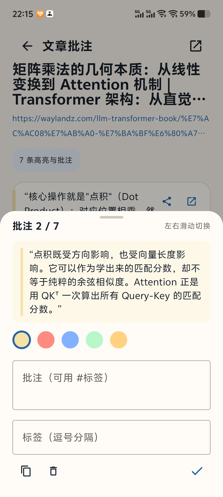</a><br />批注编辑与颜色选择
    </td>
    <td align="center">
      <a href="rawpics/Screenshot_20260818_221435.jpg">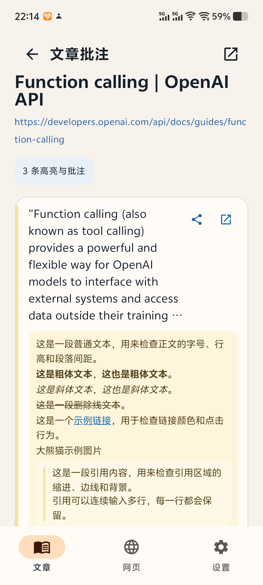</a><br />文章批注列表
    </td>
    <td align="center">
      <a href="rawpics/Screenshot_20260818_221603.jpg">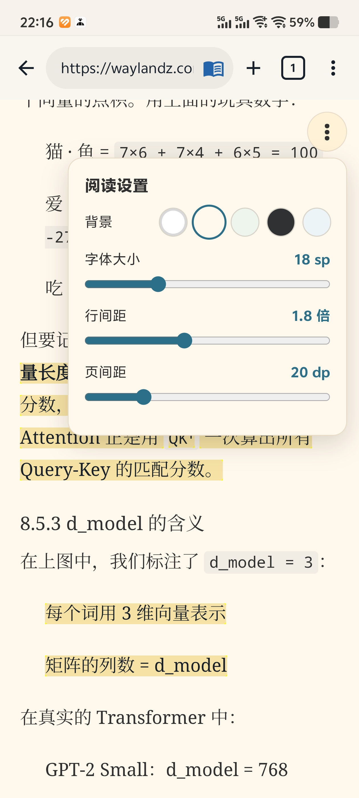</a><br />阅读设置
    </td>
  </tr>
  <tr>
    <td align="center">
      <a href="rawpics/Screenshot_20260818_221419.jpg">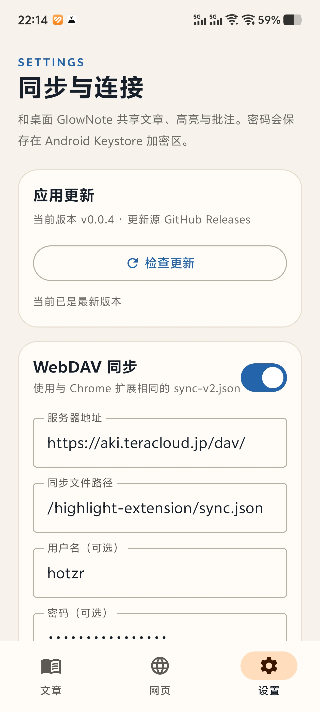</a><br />WebDAV 同步设置
    </td>
    <td align="center">
      <a href="rawpics/Screenshot_20260818_221731.jpg">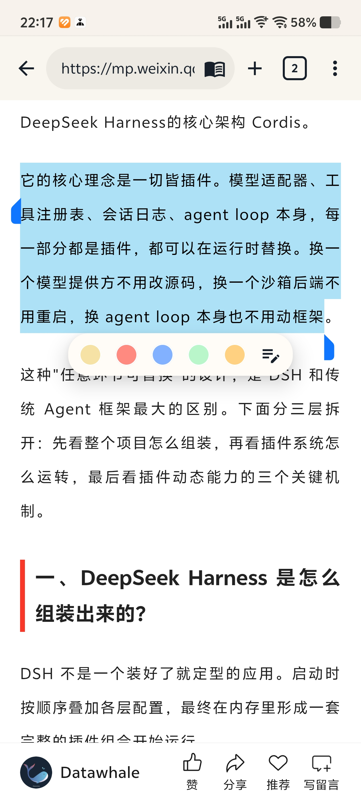</a><br />微信公众号文章高亮
    </td>
    <td align="center">
      <a href="rawpics/Screenshot_20260818_221736.jpg">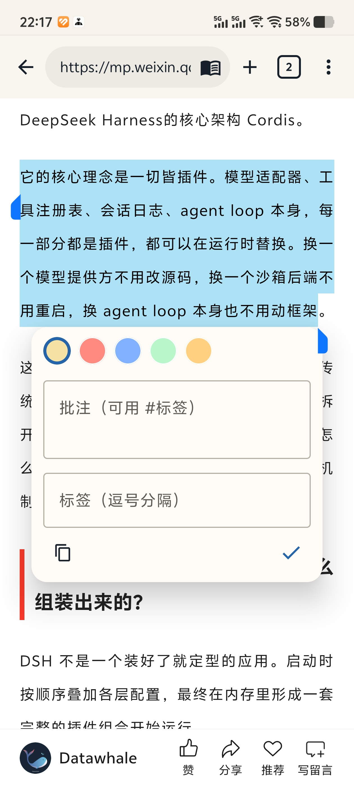</a><br />微信公众号文章批注
    </td>
  </tr>
</table>

<details>
<summary>更多运行截图</summary>

<table>
  <tr>
    <td align="center"><a href="rawpics/Screenshot_20260818_221450.jpg">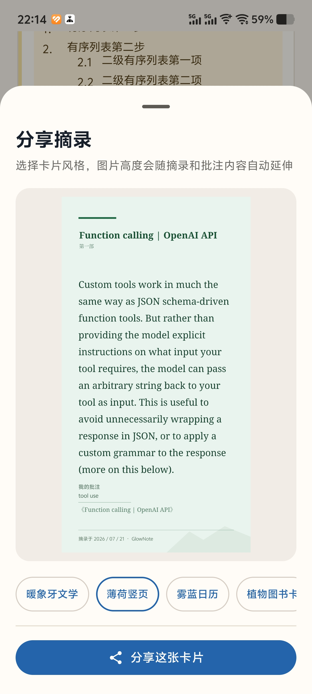</a><br />摘录分享面板</td>
    <td align="center"><a href="rawpics/Screenshot_20260818_221539.jpg">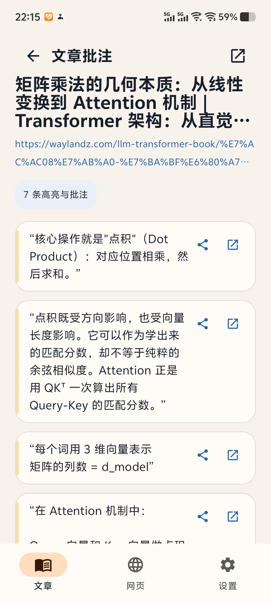</a><br />文章详情与多条高亮</td>
    <td align="center"><a href="rawpics/Screenshot_20260818_221558.jpg">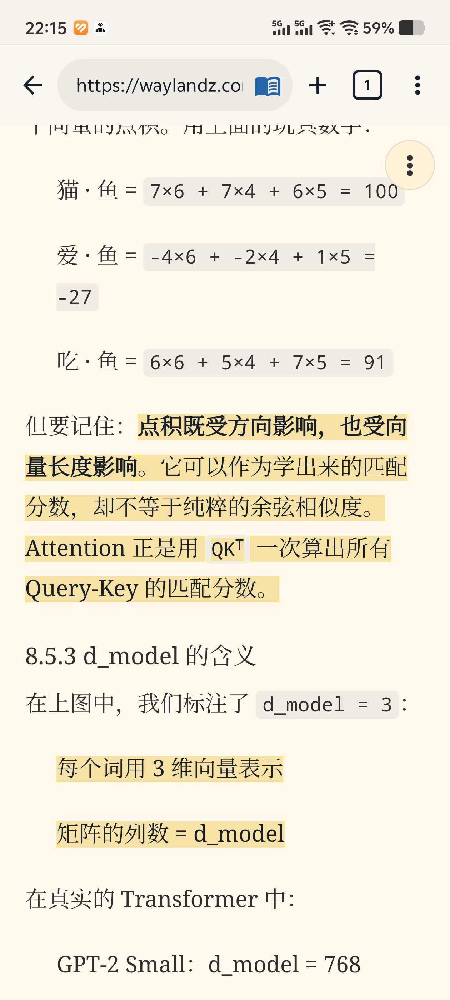</a><br />网页正文中的已保存高亮</td>
  </tr>
</table>
</details>

## 构建（开发者）

用 Android Studio 打开本目录，或在已安装 JDK 17、Android SDK 和 Gradle wrapper 的环境运行：

```powershell
$env:JAVA_HOME = "C:\Program Files\Microsoft\jdk-17.0.20.8-hotspot"
$env:ANDROID_HOME = "$env:LOCALAPPDATA\Android\Sdk"
./gradlew.bat :app:testDebugUnitTest :app:assembleDebug
```

Debug APK 输出到 `app/build/outputs/apk/debug/app-debug.apk`。
